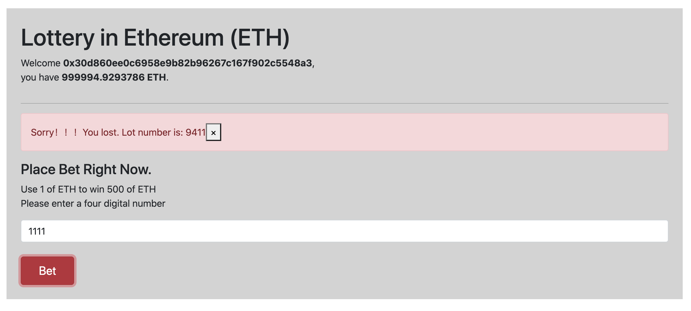

# Lottery in Ethereum

  Welcome to come here !!! smart contract uses Openzeppelin to update contract logic ,and frontend uses react to promote effect.
And then the program need nodejs(>=10.18.0) and yarn.


## How to start 

The first things you need to do are cloning this repository and installing its dependencies:
```
git clone https://github.com/tomas0451/lottery.git
cd lottery
yarn
```
Once installed, let's run truffle's testing network. Of course you can config to run other test network by edit the truffle-config.js file:

```
yarn node
```
Next,deploy contract to the test-net
```
yarn prebuild
yarn reset
```
Then, run above script ,you should get the lottery contract address of  proxy,update the address in this path "./frontend/src/contract/contract-address.json"
,and run this script
```
yarn copy
```
Finally, we can run the frontend with:
```
cd frontend
yarn
yarn start
```

Then,you can see that:




